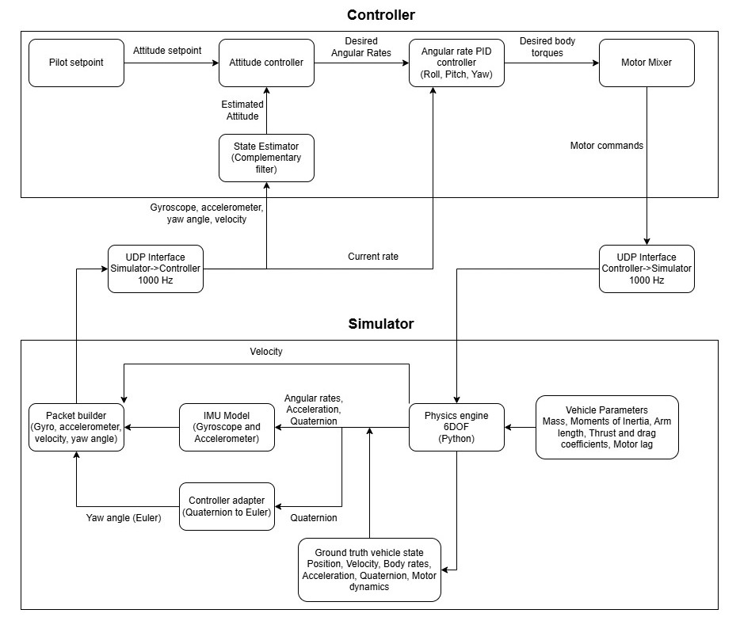
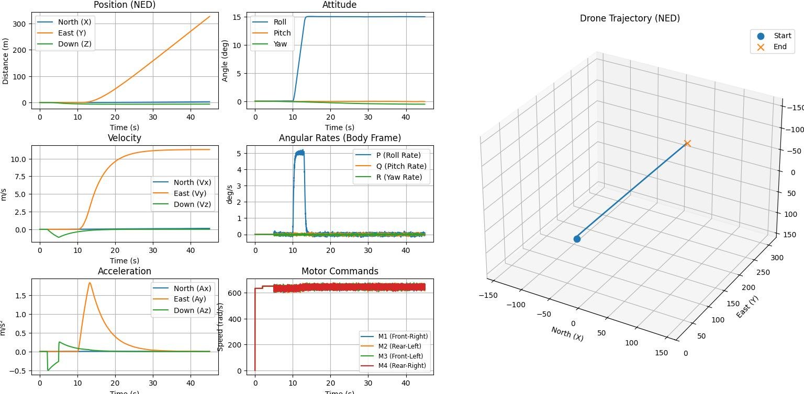
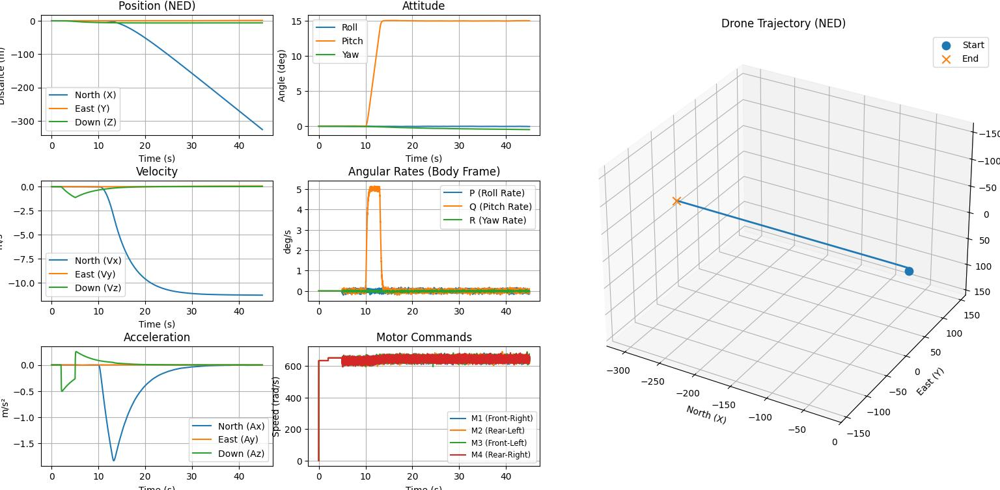
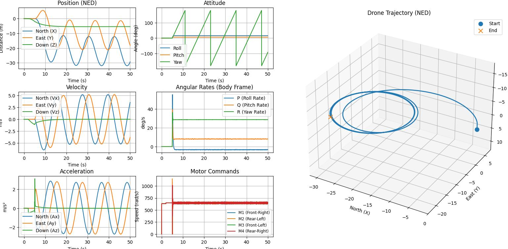

# Quadcopter SITL
A custom Software-in-the-Loop (SITL) quadcopter platform built from scratch to develop a first-principles understanding of quadrotor flight dynamics, 
control systems, and state estimation.
The project couples a Python-based 6-DOF flight dynamics simulator with a C++ flight controller through a high-frequency UDP interface.

## System Architecture

<p align="center">
    
</p>

## Current Features

### Flight Dynamics
- 6-DOF rigid-body dynamics using Newton-Euler equations
- Quaternion-based attitude representation and propagation
- Rotor thrust and reaction torque generation
- First-order motor response dynamics
- Linear aerodynamic drag modelling
  
### Flight Controller
- Cascaded PID attitude and angular-rate controller
- Analytical control allocation for X-configuration quadrotors
- Saturation-aware anti-windup protection
- Controller output allocation to individual motors

### Sensor Simulation
- Stochastic IMU model
- Accelerometer and gyroscope measurement noise
- Sensor bias drift simulation

### State Estimation
- Complementary-filter-based attitude estimation

### Communication
- High-frequency UDP communication between the simulator and controller

### Tooling
- Telemetry logging
- Graph-based visualization

# Requirements

## Operating System
The project was developed and tested on:
- Windows 11
The controller currently uses the Windows Sockets API (WinSock2). Consequently, the complete SITL pipeline is currently Windows-only. Porting the project to Linux would primarily require replacing the networking layer with BSD sockets.

---

## Python

Python 3.10 or newer.

Required packages:

```
numpy
matplotlib
```

Install using

```bash
pip install numpy matplotlib
```

---

## C++ Toolchain

The controller was developed using
- C++17
- MinGW g++
- mingw32-make
- WinSock2

---

# Building

From the repository root,

```bash
mingw32-make
```

This builds the available controller test executables.

---

# Running

1. Build the controller.

```bash
mingw32-make
```

2. Launch the desired controller executable.

Example

```bash
roll_test.exe
```

3. Open a second terminal.

Navigate to the simulator directory.

```bash
cd simulator
```

4. Start the simulator.

```bash
python main.py
```

The controller and simulator communicate over UDP throughout the simulation.

After the simulation completes, telemetry plots are generated automatically using Matplotlib.

---

# Validation

The controller was evaluated using multiple closed-loop simulation scenarios.

## Roll Tracking

<p align="center">
    
</p>

---

## Pitch Tracking

<p align="center">
    
</p>

---

## Circular Flight

<p align="center">
    
</p>

---

# Design Decisions

| Decision | Rationale |
|-----------|-----------|
| Python simulator | Rapid numerical development using NumPy |
| C++ controller | Representative of embedded flight software |
| UDP communication | Separation between plant and controller processes |
| Unit quaternions | Singularity-free attitude propagation |
| Complementary filter | Lightweight attitude estimation architecture |
| Cascaded PID | Widely adopted multirotor control architecture |

---

# Assumptions and Limitations

The simulator intentionally models only the dynamics necessary for controller development and educational exploration.

Current assumptions include:
- Rigid-body dynamics
- Linear aerodynamic drag
- First-order motor dynamics
- No wind or turbulence
- No blade flapping
- No ground effect
- No GPS or magnetometer simulation

The implemented complementary filter estimates roll and pitch using gyroscope and accelerometer measurements. To compensate for the inability of an IMU alone to distinguish gravity from translational acceleration during dynamic flight, the estimator uses simulator-derived translational acceleration. This approach is appropriate within the closed-loop simulation environment but should not be interpreted as a standalone onboard attitude estimator for real flight hardware.

---

# References

The implementation was informed by the following resources:

- MIT Vehicle Navigation and Control lecture notes
- MATLAB Drone Simulation and Control video series
- Brian Douglas — Control Systems
- AeroAcademy Flight Simulation series
- ArduPilot documentation and controller architecture

These resources provided the theoretical foundation for the mathematical models and controller architecture. The software implementation, integration, testing, and validation were carried out independently as part of this project.

---

# Project Status

**Completed**
This project was developed as a first-principles implementation of a quadrotor Software-in-the-Loop flight-control platform.
